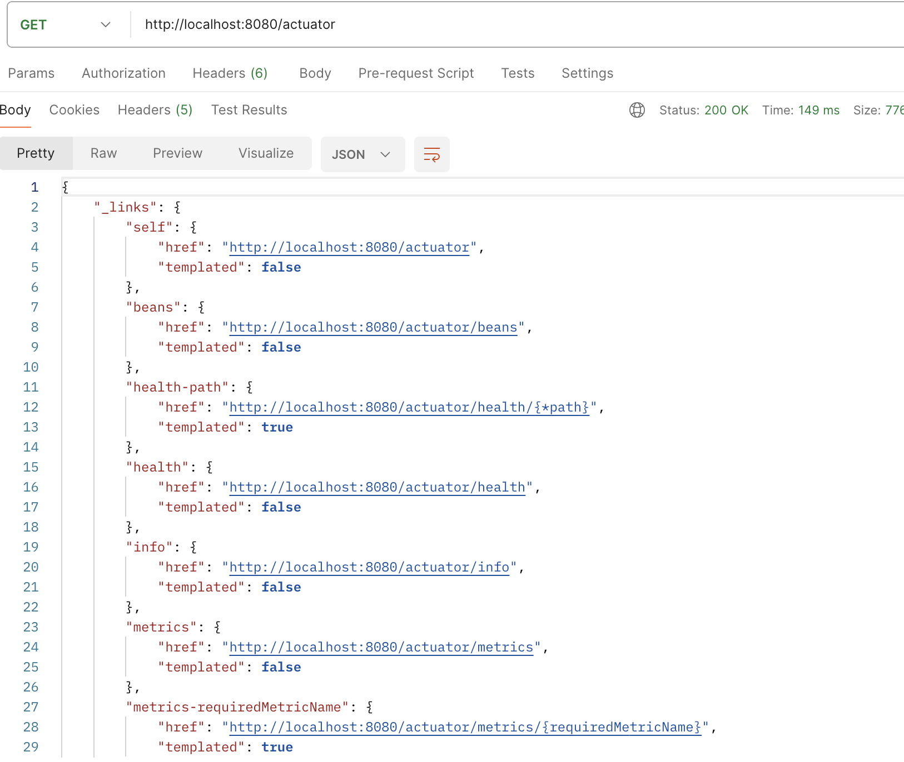
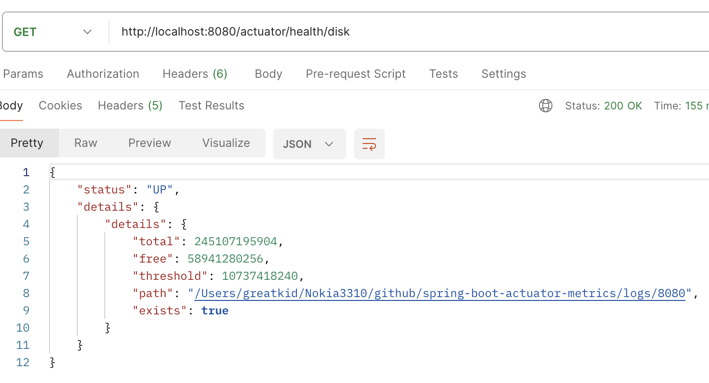
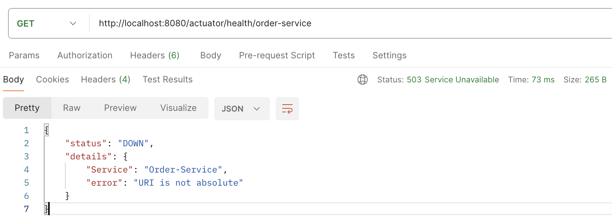

# spring-boot-actuator-custom
## Introduction
The Spring Boot Actuator, It provides several built-in endpoints and capabilities for monitoring and interacting with our application at runtime. For example 

`Health Endpoint`: It exposes information about the application's health, indicating whether the application is functioning correctly.

`Info Endpoint`: It provides custom information about the application, allowing you to expose arbitrary details such as version numbers, build information, etc.

`Metrics Endpoint`: It exposes a variety of metrics related to the application's performance, such as memory usage, garbage collection stats, and custom metrics.

or even create custom endpoints to expose additional information that we want, depending on our requirements. And, in this article, I'm going to provide some examples of custom endpoints and the important configuration that you need to know when working with actuators.


## Built-in Endpoints
The built-in endpoints are the endpoints that Spring Boot already provides for you. It's going to capture serveral aspects of information about your application for monitoring. To use built-in endpoints, it is straight-forward. You just need to define the endpoint that you want to expose in the `application. propertis` with the tag below.

`management.endpoints.web.exposure.include = endpointName1, endpointName2 `\
and\
`management.endpoint.health.show-details=always`  (Provided details are shown to all users.)

For the lists of endpoints available, please see at -> [Actuator endpoints](https://docs.spring.io/spring-boot/docs/current/reference/html/actuator.html#actuator.endpoints)

Once you've done the setup of the above configuration, run the application and navigate to the endpoint `http://localhost:8080/actuator`. It's going to provide all the available endpoints that you can access in the illustration below.

<p align="center">
  
</p>


## Custom Endpoints
To custom endpoint, it' require coding for custom meet specific requirement, So I'm going to provide 3 example custom endpoint for health checking at following 
* Checks for low disk space.
* Checks that a connection to DataSource can be obtained.
* Ping target service

For custom endpoint configuration, we have to declare the class as bean, and the path for access will be align with the bean name. Please look at more details in the example below.

### Checks for low disk space.
 ```java
@Component("disk")
public class CheckDiskSpaceHealthIndicator implements HealthIndicator {
    private DiskSpaceHealthIndicator disk;
    private String path;
    private int threshold;

    @Value("${custom.actuator.disk.path}")
    public void setPath(String path) {
        this.path = path;
    }

    @Value("${custom.actuator.disk.threshold.gb}")
    public void setThreshold(int threshold) {
        this.threshold = threshold;
    }

    @Override
    public Health health() {
        try {
            this.disk = new DiskSpaceHealthIndicator(new File(path), DataSize.ofGigabytes(threshold));
            Health originalHealth = disk.health();
            if (originalHealth.getStatus().equals(Status.UP)) {
                return Health.up().withDetail("details", originalHealth.getDetails()).build();
            } else {
                return Health.down().withDetail("error", originalHealth.getDetails()).build();
            }
        } catch (Exception e) {
            return Health.down().withDetail("error", "Failed to check disk space").build();
        }
    }
}
 ```
In the code example above, it's going to check available disk space and compare it between threshold and free. If `threshold < free` : will return status `DOWN`. And the endpoint to access is `http://localhost:8080/actuator/health/disk`.
<p align="center">
  
</p>

### Checks that a connection to DataSource can be obtained.
 ```java
@Component("h2")
public class DatabaseHealthIndicator implements HealthIndicator {

    @Override
    public Health health() {
        int errorCode = check();
        if (errorCode != 0) {
            return Health.down().withDetail("Error code", errorCode).build();
        }
        return Health.up()
                .withDetail("database", "h2")
                .withDetail("indicatorType", "custom")
                .build();
    }

    public int check() {
        try (Connection connection = DriverManager.getConnection("jdbc:h2:mem:demo", "sa", "zxcv")) {
            connection.createStatement().execute("SELECT 1");
        } catch (SQLException exception) {
            System.out.println(exception.toString());
            return 1;
        }
        return 0;
    }
}
 ```
The code example above, it's going to check connection to H2 database if able to connect, it's going to return status `UP`. And the endpoint to access is `http://localhost:8080/actuator/health/h2`.
<p align="center">
  
</p>

### Ping target service

 ```java
@Component("order-service")
public class PingServiceHealthIndicator implements HealthIndicator {
    private final RestTemplate restTemplate;
    private String orderServiceEndpoint;

    @Autowired
    public PingServiceHealthIndicator(RestTemplate restTemplate) {
        this.restTemplate = restTemplate;
    }

    @Value("${custom.actuator.ping.order.service}")
    public void setOrderServiceEndpoint(String orderServiceEndpoint) {
        this.orderServiceEndpoint = orderServiceEndpoint;
    }

    @Override
    public Health health() {
        try {
            String response = restTemplate.getForObject(orderServiceEndpoint, String.class);
            if (response != null && !response.isEmpty()) {
                return Health.up().withDetail("Service", "Order-Service").withDetail("message", response).build();
            } else {
                return Health.down().withDetail("Service", "Order-Service").withDetail("error", "Unable to reach out order-service").build();
            }
        } catch (Exception exception) {
            return Health.down().withDetail("Service", "Order-Service").withDetail("error", exception.getMessage()).build();
        }
    }
}
 ```
The code example above, using restTemplate to call get method to Order service, if get response back from order service will be show status `UP`, on the other hand will be `DOWN` like picutre below. (The order service must implement a health check endpoint.)\
The endpoint to access is `http://localhost:8080/actuator/health/order-service`.
<p align="center">
  
</p>

## Health Groups
The health group is that we can group multiple endpoints into a single endpoint and show all the results at the same time. For example, in the example above, we have 3 endpoints following
* http://localhost:8080/actuator/health/disk
* http://localhost:8080/actuator/health/h2
* http://localhost:8080/actuator/health/order-service

We can group then into a single endpoint by configure applicaiton.properties at following \

`management.endpoint.health.group.multi.include = disk,h2,order-service`

`multi` is going to be an endpoint for grouping three services, so you should customize the endpoint at `multi`  to whatever you want.
The final endpoint from the example's going to be 'http://localhost:8080/actuator/health/multi', and the result is shown in the picture below:

<p align="center">
  
</p>


[spring-boot-starter-actuator](https://docs.spring.io/spring-boot/docs/current/reference/html/actuator.html)\
[Health Indicators in Spring Boot](https://www.baeldung.com/spring-boot-health-indicators)\
[Spring Boot Health actuator](https://springhow.com/spring-boot-health-check-indicators/)
